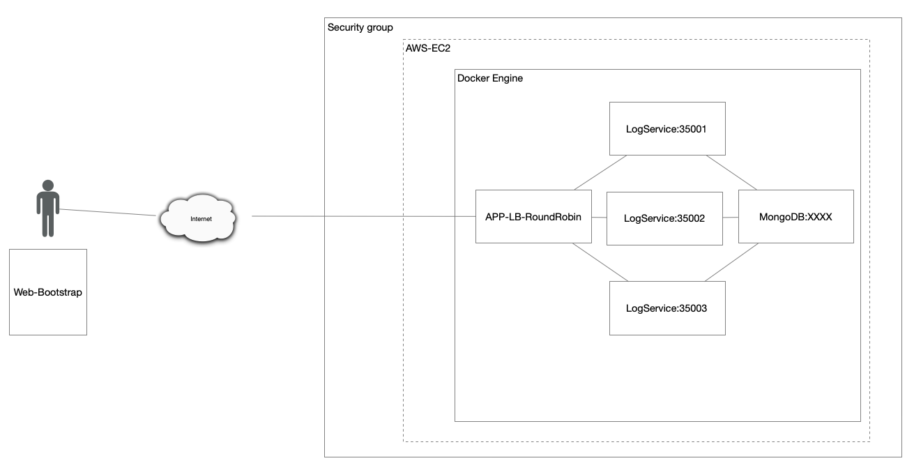
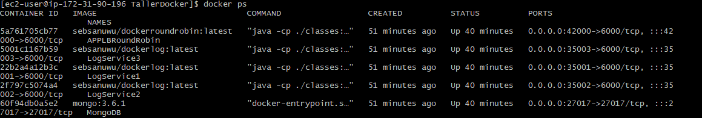
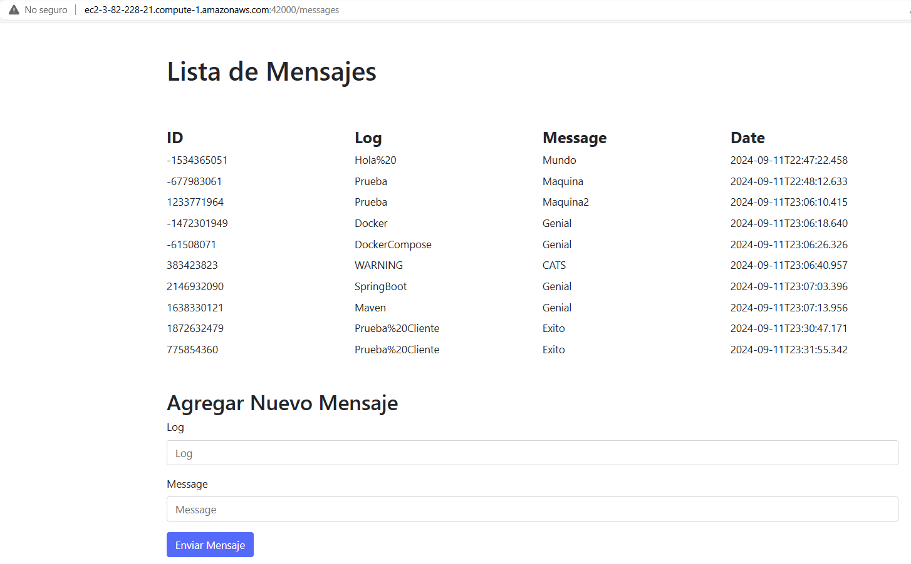
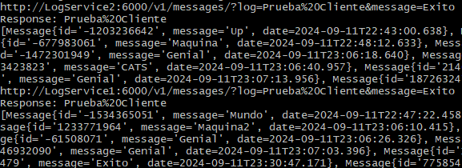

# Taller 3 Docker - MODULARIZACIÓN CON VIRTUALIZACIÓN E INTRODUCCIÓN A DOCKER

Este proyecto consiste en la creación de toda una arquitectura de software para la consulta de logs. La arquitectura está orquestada por contenedores Docker y está diseñada para ser desplegada en la nube de AWS (EC2).

## Arquitectura

1. **MongoDB**: Es un servicio que corre como instancia de MongoDB en un contenedor Docker dentro de una máquina virtual EC2.
2. **LogService**: Es un servicio REST que recibe cadenas de texto, las almacena en la base de datos y devuelve un objeto JSON con las 10 últimas cadenas almacenadas, junto con la fecha en la que fueron ingresadas.
3. **APP-LB-RoundRobin**: Es una aplicación web compuesta por un cliente web y al menos un servicio REST. El cliente web cuenta con un campo de texto y un botón, donde el usuario puede enviar mensajes. Cada vez que el usuario envía un mensaje, este es procesado por el servicio REST, el cual implementa un algoritmo de balanceo de cargas "Round Robin". El servicio REST delega el procesamiento de los mensajes y la respuesta a una de las tres instancias del servicio LogService de manera equilibrada.

A continuación, se muestra una imagen de la arquitectura propuesta y desplegada:




La carpeta **DockerTaller** tiene el proyecto de LogService. La carpeta **APP-LB-RoundRobin** es el APP-LB-RoundRobin con el cliente web.

## Getting Started

Estas instrucciones te ayudarán a obtener una copia del proyecto en funcionamiento en tu máquina local para fines de desarrollo.

### Prerequisitos

#### Para desarrollo:

Si deseas contribuir al desarrollo del proyecto, asegúrate de tener las siguientes herramientas instaladas:

- **Java JDK 8 o superior**: Requerido para compilar y ejecutar el código Java.
- **Maven 3.6.0 o superior**: Utilizado para la gestión de dependencias y la automatización del proceso de construcción.
- **Un IDE (Entorno de Desarrollo Integrado)**: Recomendamos IntelliJ IDEA, Eclipse, o cualquier otro IDE que soporte proyectos Java y Maven.
- **Git 2.25.0 o superior** (opcional): Para clonar y gestionar el repositorio del proyecto.

#### Para ejecutar el proyecto:

Si solo quieres ejecutar el proyecto, solo necesitarás las siguientes herramientas:

- **Docker 20.10.7 o superior**: Necesario para construir y ejecutar los contenedores.
- **Docker Compose 1.29.2 o superior**: Para la orquestación de múltiples contenedores Docker.

Opcionalmente, si deseas desplegar en AWS:

- **AWS CLI 2.2.0 o superior** (opcional): Para interactuar con los servicios de Amazon Web Services desde la línea de comandos.

### Installing

Una serie de pasos para poner en marcha la arquitectura:

1. **Clonar el repositorio** desde GitHub:
```
git clone https://github.com/SebSanUwU/Taller-Docker.git
```
2. **Navegar al directorio del proyecto**:
```
cd Taller-Docker
```
3. **Ejecutar el archivo docker-compose.yml** usando docker-compose:
```
docker-compose up -d
```
4. **[URL](http://localhost:42000/messages)** El cliente estará listo para recibir tus peticiones en tu dirección local por el puerto 42000.

## Despliegue en la nube

Para el despliegue usamos una máquina **EC2** de AWS. EC2 es un servicio de instancias de máquinas virtuales en la nube que nos permite desplegar nuestra arquitectura en Internet.

Si deseas desplegar el proyecto de la misma manera, solo sigue estos pasos:

1. Lleva el archivo `docker-compose.yml` a la instancia EC2.
2. Asegúrate de haber instalado **Docker** y **Docker Compose** en la instancia.
3. Ejecuta el archivo `docker-compose.yml`.

Una vez en ejecución, asegúrate de modificar las **reglas de entrada** de seguridad de la instancia EC2 para permitir el acceso al puerto **42000**, de modo que la aplicación sea accesible desde Internet.

## Video Explicación y Prueba Integral

Puedes ver una demostración integral de la arquitectura funcionando en nube en el siguiente video:

[VideoFuncionamientoNubeAWS.mp4](ReadMeContent%2FVideoFuncionamientoNubeAWS.mp4)

---

### Arquitectura Desplegada en Docker

A continuación, se muestra la arquitectura del proyecto en contenedores Docker:



---

### Cliente Desplegado en AWS

El cliente ha sido exitosamente desplegado en AWS, como se observa en la siguiente imagen:



---

### Logs del Contenedor de Cliente

Aquí puedes ver los logs del contenedor del cliente, demostrando el funcionamiento del algoritmo de balanceo de carga **Round Robin**:



## DETAILS

Para los logs. Se creo un modelo de id, log, message y date.

## Built With

* [Maven](https://maven.apache.org/) - Gestión de dependencias
* [Spring Boot](https://spring.io/projects/spring-boot) - Framework para el desarrollo de aplicaciones Java
* [MongoDB](https://www.mongodb.com/) - Base de datos NoSQL utilizada para el almacenamiento de logs
* [Docker](https://www.docker.com/) - Plataforma para la creación y gestión de contenedores
* [Docker Compose](https://docs.docker.com/compose/) - Orquestación de contenedores Docker
* [AWS EC2](https://aws.amazon.com/ec2/) - Servicio de nube donde se desplegó la aplicación
* [Git](https://git-scm.com/) - Sistema de control de versiones

## Authors

* **Juan Sebastian Camargo Sanchez** - *AREP* - [SebSanUwU](https://github.com/SebSanUwU)
